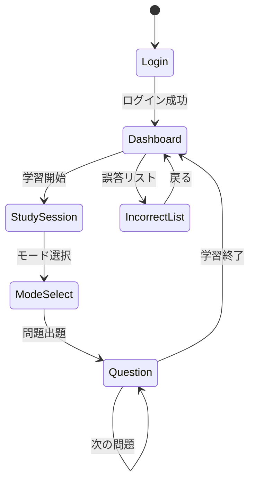

# 英語リスニング学習アプリの要件定義と詳細設計

## 1. 概要
Anki形式の間隔反復学習を取り入れた英語リスニング学習アプリケーション。
Cloud Text-to-Speech APIを活用し、静的に用意された英文の聞き取り練習を行うシステム。

## 2. 目的
- ユーザーの英語リスニング能力の向上
- 効率的な復習システムによる学習効果の最大化
- シンプルで使いやすい学習環境の提供

## 3. スコープ
### 含まれるもの
- 会員登録・認証システム
- 問題出題・回答システム
- 音声再生機能
- 復習間隔管理機能
- 誤答リスト管理

### 含まれないもの
- 進捗管理システム
- 学習データ分析機能
- 問題の難易度設定
- オフライン対応
- ユーザー間のソーシャル機能

## 4. 機能要件

### ユーザー管理
1. 事前調査
   - Googleフォームでの応募受付
   - メールアドレス、年齢、学習意欲などの収集
   - 招待コードの発行とメール送信

2. アカウント管理
   - 招待コードによるサインアップ
   - メールアドレスによるログイン

### 学習機能
1. 学習モード選択
   - 新規学習のみ
   - 復習のみ
   - 新規と復習の混合

2. 問題出題
   - 静的JSONからのランダム出題
   - Cloud Text-to-Speech APIによる音声再生
   - 3段階評価による回答（もう一度/微妩/聞き取れた）

3. 誤答管理
   - 誤答リストの表示
   - 問題の手動削除
   - 復習の一時停止

## 5. 技術要件
- フロントエンド：Next.js App Router
- バックエンド：Supabase
- 音声API：Cloud Text-to-Speech API
- データベース：PostgreSQL (Supabase)
- 認証：Supabase Auth
- ホスティング：Netlify

## 6. データモデル設計

### 静的データ
```typescript
// types/sentences.ts
interface Sentence {
  id: string;
  content: string;
}

// data/sentences.ts
const sentences: Sentence[] = [
  {
    id: "1",
    content: "The weather is nice today."
  },
  // ... 他の文章
];
```

### データベーステーブル
```sql
-- Users table (Supabase Auth)
auth.users {
  id uuid PK
  email string
  created_at timestamp
}

-- Study records table
create table study_records (
  id uuid primary key default uuid_generate_v4(),
  user_id uuid references auth.users(id),
  sentence_id string,
  result smallint,  -- 1: もう一度, 2: 微妙, 3: 聞き取れた
  next_review timestamp,
  mastered boolean default false,
  created_at timestamp default now(),
  
  constraint result_check check (result in (1,2,3))
);

-- RLSポリシー
alter table study_records enable row level security;
create policy "Users can only access their own records"
  on study_records for all
  using (auth.uid() = user_id);
```

## 7. 画面設計

### 画面一覧
1. ログイン画面 (/login)
2. ダッシュボード画面 (/)
3. 学習画面 (/study)
4. 誤答リスト画面 (/incorrect)

### 画面遷移図


### コンポーネント構成
```tsx
// app/layout.tsx
<RootLayout>
  <Navbar />
  <main>{children}</main>
</RootLayout>

// app/page.tsx (Dashboard)
<DashboardPage>
  <StudyStartButton />
  <IncorrectAnswersSummary />
</DashboardPage>

// app/study/page.tsx
<StudyPage>
  <StudyModeSelector />
  <AudioPlayer />
  <AnswerButtons />
</StudyPage>

// app/incorrect/page.tsx
<IncorrectListPage>
  <IncorrectList>
    <SentenceItem />
  </IncorrectList>
</IncorrectListPage>
```

## 8. APIエンドポイント設計

### API Routes
```typescript
// app/api/auth/route.ts
POST /api/auth/register    // 新規登録
POST /api/auth/login       // ログイン

// app/api/study/route.ts
POST /api/study/record     // 学習記録の保存
GET  /api/study/incorrect  // 誤答リスト取得
PUT  /api/study/status     // 問題ステータス更新
```

## 9. 主要機能の実装詳細

### 問題出題ロジック
```typescript
function getNextQuestion(mode: 'new' | 'review' | 'mixed'): Sentence {
  switch (mode) {
    case 'new':
      return getRandomNewQuestion();
    case 'review':
      return getRandomReviewQuestion();
    case 'mixed':
      return Math.random() > 0.5 
        ? getRandomNewQuestion()
        : getRandomReviewQuestion();
  }
}
```

### 復習間隔の計算
```typescript
function calculateNextReview(result: 1 | 2 | 3): Date {
  const now = new Date();
  switch (result) {
    case 1: // もう一度
      return now;
    case 2: // 微妙
      return addDays(now, 3);
    case 3: // 聞き取れた
      return addDays(now, 7);
  }
}
```

## 10. セキュリティ設計

### 認証・認可
- Supabase Authによるメール認証
- JWTトークンによるAPI認証
- Row Level Securityによるデータアクセス制御

### データ保護
- HTTPS通信の強制
- クロスサイトスクリプティング(XSS)対策
- クロスサイトリクエストフォージェリ(CSRF)対策

## 11. デプロイメント設計

### インフラストラクチャ
- ホスティング：Netlify
  - ビルド設定：
    ```toml
    # netlify.toml
    [build]
      command = "npm run build"
      publish = ".next"

    [[plugins]]
      package = "@netlify/plugin-nextjs"
    ```
- バックエンド：Supabase

### 環境変数
```plaintext
# .env
NEXT_PUBLIC_SUPABASE_URL=
NEXT_PUBLIC_SUPABASE_ANON_KEY=
SUPABASE_SERVICE_ROLE_KEY=
GOOGLE_CLOUD_TTS_API_KEY=
```

### デプロイフロー
1. GitHubリポジトリへのプッシュ
2. Netlifyによる自動ビルドとデプロイ
3. 環境変数の設定（Netlify管理画面）
4. Supabaseプロジェクトとの連携

## 12. 今後の拡張性

将来的な機能追加に備えて以下の点を考慮：
- 問題データの外部ファイル化
- 難易度設定の追加
- 進捗分析機能の追加
- オフラインモードの実装
