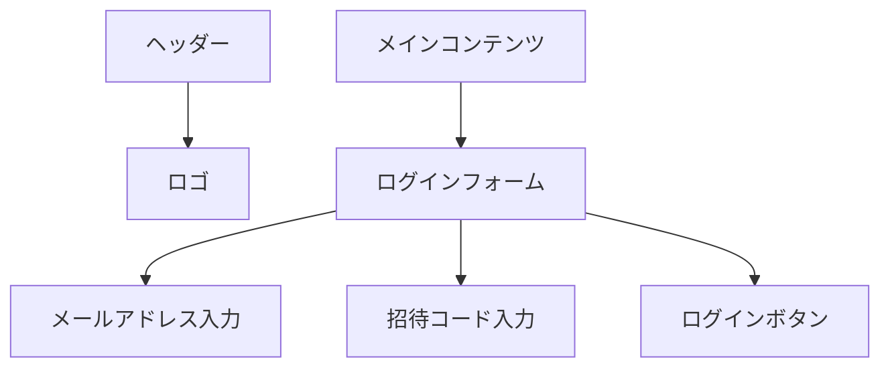
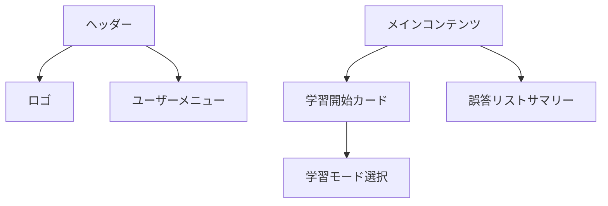
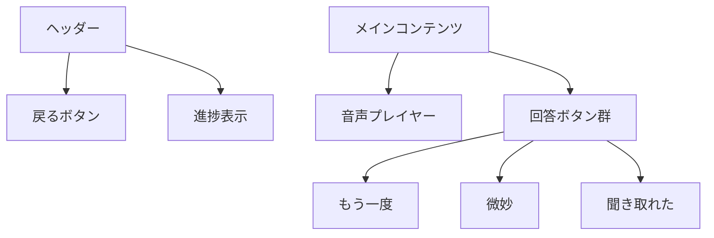
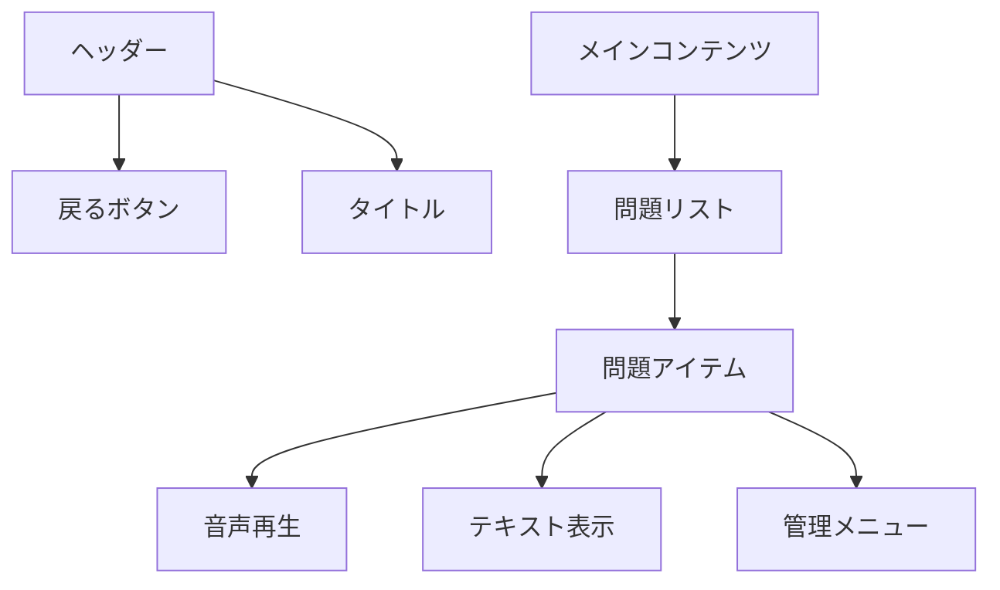

# UI/UX 詳細設計書

## 1. 基本デザインシステム

### カラーパレット

```css
:root {
  /* プライマリカラー - インディゴ */
  --primary-50: #eef2ff;
  --primary-100: #e0e7ff;
  --primary-500: #6366f1;
  --primary-600: #4f46e5;

  /* アクセントカラー - 回答ボタン用 */
  --danger-500: #ef4444; /* もう一度 */
  --warning-500: #f59e0b; /* 微妙 */
  --success-500: #22c55e; /* 聞き取れた */

  /* モノクロ */
  --gray-50: #f9fafb;
  --gray-100: #f3f4f6;
  --gray-700: #374151;
  --gray-900: #111827;
}
```

### タイポグラフィ

```css
:root {
  --font-sans: "Inter", system-ui, sans-serif;
  --font-mono: "JetBrains Mono", monospace;
}
```

## 2. 画面詳細設計

### ログイン画面 (/login)



コンポーネント構成:

```tsx
// app/login/page.tsx
export default function LoginPage() {
  return (
    <div className="min-h-screen bg-gray-50">
      <div className="max-w-md mx-auto pt-16 px-4">
        <div className="text-center mb-8">
          <h1 className="text-2xl font-bold">English Listening App</h1>
        </div>

        <div className="bg-white rounded-lg shadow p-6">
          <form className="space-y-4">
            <div>
              <label className="block text-sm font-medium mb-1">
                メールアドレス
              </label>
              <input type="email" className="w-full rounded-md border" />
            </div>

            <div>
              <label className="block text-sm font-medium mb-1">
                招待コード
              </label>
              <input type="text" className="w-full rounded-md border" />
            </div>

            <button className="w-full bg-primary-600 text-white rounded-md py-2">
              ログイン
            </button>
          </form>
        </div>
      </div>
    </div>
  );
}
```

### ダッシュボード画面 (/)



コンポーネント構成:

```tsx
// app/page.tsx
export default function DashboardPage() {
  return (
    <div className="max-w-2xl mx-auto px-4 py-8">
      <div className="grid gap-6">
        {/* 学習開始カード */}
        <div className="bg-white rounded-lg shadow p-6">
          <h2 className="text-xl font-semibold mb-4">学習を始める</h2>

          <div className="grid gap-4">
            <button className="bg-primary-600 text-white rounded-md py-3 px-4">
              新規学習
            </button>

            <button className="bg-primary-100 text-primary-600 rounded-md py-3 px-4">
              復習
            </button>

            <button className="bg-gray-100 text-gray-700 rounded-md py-3 px-4">
              ミックスモード
            </button>
          </div>
        </div>

        {/* 誤答リストサマリー */}
        <div className="bg-white rounded-lg shadow p-6">
          <h2 className="text-xl font-semibold mb-4">要復習の問題</h2>
          <div className="text-gray-700">現在 12 問の復習が必要です</div>
          <button className="mt-4 text-primary-600">誤答リストを見る →</button>
        </div>
      </div>
    </div>
  );
}
```

### 学習画面 (/study)



コンポーネント構成:

```tsx
// app/study/page.tsx
export default function StudyPage() {
  return (
    <div className="min-h-screen bg-gray-50">
      {/* ヘッダー */}
      <header className="bg-white border-b">
        <div className="max-w-2xl mx-auto px-4 py-4 flex items-center">
          <button className="text-gray-700">← 戻る</button>
          <div className="ml-auto">問題 3/10</div>
        </div>
      </header>

      {/* メインコンテンツ */}
      <div className="max-w-2xl mx-auto px-4 py-8">
        <div className="bg-white rounded-lg shadow p-6">
          {/* 音声プレイヤー */}
          <div className="mb-8 text-center">
            <button className="bg-primary-600 text-white rounded-full p-4">
              <PlayIcon className="w-8 h-8" />
            </button>
          </div>

          {/* 回答ボタン */}
          <div className="grid gap-4">
            <button className="bg-danger-500 text-white rounded-md py-3">
              もう一度
            </button>

            <button className="bg-warning-500 text-white rounded-md py-3">
              微妙
            </button>

            <button className="bg-success-500 text-white rounded-md py-3">
              聞き取れた
            </button>
          </div>
        </div>
      </div>
    </div>
  );
}
```

### 誤答リスト画面 (/incorrect)



コンポーネント構成:

```tsx
// app/incorrect/page.tsx
export default function IncorrectListPage() {
  return (
    <div className="max-w-2xl mx-auto px-4 py-8">
      <h1 className="text-2xl font-bold mb-6">復習が必要な問題</h1>

      <div className="bg-white rounded-lg shadow divide-y">
        {/* 問題アイテム */}
        <div className="p-4">
          <div className="flex items-center gap-4">
            <button className="text-primary-600">
              <PlayIcon className="w-6 h-6" />
            </button>

            <div className="flex-1">
              <p className="text-gray-700">The weather is nice today.</p>
              <p className="text-sm text-gray-500">次回復習: 3日後</p>
            </div>

            <button className="text-gray-400">
              <DotsVerticalIcon className="w-5 h-5" />
            </button>
          </div>
        </div>

        {/* 他の問題アイテム */}
      </div>
    </div>
  );
}
```

## 3. インタラクション設計

### 音声再生

- 再生ボタンクリック時に音声を再生
- 再生中は再生ボタンをスピナーに変更
- 再生完了後に再生ボタンを復帰
- ショートカットキー: スペースキーで再生/停止

### 回答フィードバック

- 回答ボタンクリック時に軽いアニメーション
- 回答後に次の問題へのトランジション表示
- 学習セッション終了時に成績サマリーを表示

### エラーハンドリング

- 音声読み込みエラー時のリトライ UI
- ネットワークエラー時の通知
- 未認証時のリダイレクト

## 4. レスポンシブ対応方針

- モバイルファーストで実装。

### ブレイクポイント

```css
/* tailwind.config.js */
module.exports = {
  theme: {
    screens: {
      'sm': '640px',
      'md': '768px',
      'lg': '1024px',
    }
  }
}
```

### モバイル最適化

- モバイルファーストで実装。
- PC 画面用に最低限のレスポンシブは必須。
- タッチターゲットを最小 48x48px に設定
- スワイプでの操作対応
- 画面回転対応
- モバイルでのキーボード表示時のレイアウト調整

これらのデザイン要素を実装することで、使いやすく直感的なユーザーインターフェースを実現します。次のステップとして、これらのコンポーネントの実装に移りたいと思いますが、まず以下の点について確認させていただけますでしょうか：
